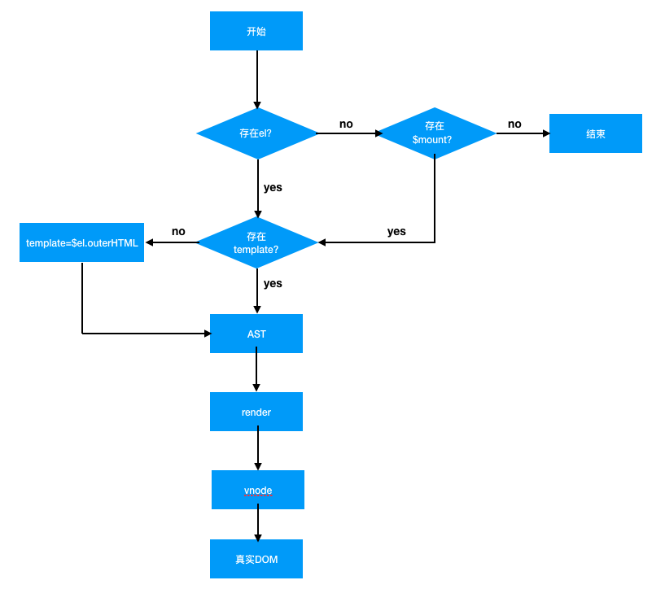

# Vue-Notes
Vue Family Meals.


## Vue 基础

### 插值表达式

```vue
<div id="app">
  <!-- 1 -->
  {{ 1 }}
  <!-- 1 -->
  {{ '1' }}
  <!-- true -->
  {{ true }}
  <!-- false -->
  {{ false }}
  <!-- { "name": "Flinn", "age": 21 } -->
  {{ {name: 'Flinn', age: 21} }}
  <!-- [ 1, 3, 2 ] -->
  {{ [1, 3, 2] }}
  <!-- 不显示 -->
  {{ undefined }}
</div>
```

**注意点**

1. 我们如果要在插值表达式中使用变量，那么需要先在`data`属性中定义
2. 数据要先存在，才能实现数据绑定（数据劫持）

### Vue实例

```vue
<div id="app">
  <!-- 显示：hello vue [ 999, 2, 3, 4 ] { "name": "Flinn", "age": 21 } -->
  {{ message }} {{ arr }} {{ obj }}
</div>

<script>
  // 创建一个Vue实例 vm
  const vm = new Vue({
    // 挂载在id为app的元素上
    el: '#app',
    data: {
      message: 'hello vue',
      arr: [1, 2, 4],
      obj: {
        name: 'finn'
      }
    }
  })
  
  // 如果没有指定 el，也可以使用实例方法$mount()来选择所要挂载的DOM
	// vm.$mount('#app')
  
  // 在数组arr下标为 2 的位置开始删除 0 个元素 然后插入 3 这个数字
  vm.arr.splice(2, 0, 3)
  // $set(obj, key, value)
  vm.$set(vm.obj, 'name', 'Flinn')
  // 没有这个key值 则新建
  vm.$set(vm.obj, 'age', 21)
  // 数组也可以
  vm.$set(vm.arr, '0', 999)
  
  // 通过vm.$el 可以拿到Vue实例挂载的原生DOM
  console.log(vm.$el) // <div id="app"></div>
  
  // 其实，页面的渲染过程是异步的
  // 输出：hello vue [ 1, 2, 4 ] { "name": "finn" }
  console.log(vm.$el.innerText)

  // 如果要在页面渲染完成后输出 可以使用实例方法 $nextTick
  // 输出：hello vue [ 999, 2, 3, 4 ] { "name": "Flinn", "age": 21 }
  vm.$nextTick(() => console.log(vm.$el.innerText))
</script>
```

**注意点**

1. 通过索引的方式去改变数组，不能使视图渲染
2. 通过数组改变长度的方式去改变数组，不能使视图渲染
3. 如果要改变数组推荐使用数组变异方法：pop、push、unshift、shift、sort、reverse、splice
4. 可以使用Vue实例方法`vm.$set(target, key, value)`，来改变数组或者对象的某项
5. 页面的渲染过程是异步的，使用Vue实例方法`$nextTick`可以在页面异步渲染完成后做一些操作


### 指令

1. `v-pre`

```vue
<div id="app">
  <!-- 显示：hello -->
  <div>
    {{ 'hello' }}
  </div>
  <!-- 显示：{{ 'hello' }} -->
  <div v-pre>
    {{ 'hello' }}
  </div>
</div>
```

2. `v-cloak`（用得很少，只在.html文件有效，单文件直接就是编译好的结果）

在vue编译为原生js的过程中，需要一定的时间，在这空档期间可能会出现一些问题，例如：页面显示很多`{{}}`的字符闪现一下才变为正常的页面。而`v-cloak`指令只会在vue编译完成前有效，vue编译完成后，`v-cloak`指令会被移除，这就可以利用`v-cloak`来解决上面类似的问题了。

```vue
<style>
  [v-cloak] {
    display: none;
  }
</style>

<div id="app">
  <div v-cloak>
 		...
  </div>
</div>
```

3. `v-once`

```vue
<div id="app">
  <div v-once>
    <!-- 显示的仍然是 hello vue -->
    <!-- v-once 具有缓存效果 拿到的始终是第一次的值 -->
    {{ message }}
  </div>
</div>

<script>
  // 创建一个Vue实例 vm
  const vm = new Vue({
    // 挂载在id为app的元素上
    el: '#app',
    data: {
      message: 'hello vue'
    }
  })
  
  vm.message = 'Hi'

</script>
```

4. `v-html`

注意点，使用v-html时，其填入值一定是可信任的，假设填入`""`，那么页面就挂掉了，挂掉还是小事，最关键是XSS攻击造成的网络安全问题。

```vue
<div id="app">
  <!-- 显示：hello vue -->
  <div v-html='dom'>
  </div>
</div>

<script>
  // 创建一个Vue实例 vm
  const vm = new Vue({
    // 挂载在id为app的元素上
    el: '#app',
    data: {
      dom: `<div>hello vue</div>`
    }
  })

</script>
```

5. `v-text`（用得很少，一般可以用插值表达式替代）

```vue
<div id="app">
  <!-- 显示：hello vue -->
  <div v-text='message'>
    <!-- 下面这些不会显示 -->
    sjflksajldfasjl
  </div>
</div>

<script>
  // 创建一个Vue实例 vm
  const vm = new Vue({
    // 挂载在id为app的元素上
    el: '#app',
    data: {
      message: 'hello vue'
    }
  })

</script>
```

6. `v-if`& `v-else-if`& `v-else`

当v-if为false时，是完完全全的移除元素。而当v-show为false，DOM结构仍存在，只是样式改为了`display: none`

```vue
<div id="app">
  <h1>
    <!-- template相当于是个空标签 可以使用指令 -->
    <template v-if='isShow'>
      {{ message }}
    </template>
    <!-- 这个中间千万不能插入其它值 -->
    <template v-else>
      {{ 'message is not show' }}
    </template>
  </h1>
</div>

<script>
  // 创建一个Vue实例 vm
  const vm = new Vue({
    // 挂载在id为app的元素上
    el: '#app',
    data: {
      message: 'hello vue',
      isShow: false
    }
  })
</script>
```

多分支：

```vue
<div id="app">
  <h1>
    <!-- template相当于是个空标签 可以使用指令 -->
    <template v-if='count === 0'>
      {{ 'count is 0' }}
    </template>
    <!-- 这个中间千万不能插入其它值 -->
    <template v-else-if="count === 1">
      {{ 'count is 1' }}
    </template>
    <template v-else>
      {{ 'count is not 1 and 2' }}
    </template>
  </h1>
</div>

<script>
  // 创建一个Vue实例 vm
  const vm = new Vue({
    // 挂载在id为app的元素上
    el: '#app',
    data: {
      message: 'hello vue',
      count: 3
    }
  })
</script>
```

7. `v-show`

- 当v-if为false时，是完完全全的移除元素。而当v-show为false，DOM结构仍存在，只是样式改为了`display: none`

- 在v-show上，空节点`template`不生效

```vue
<div id="app">
<!--  显示：hello vue  -->
  <h1 v-show="isShow">
    {{ message }}
  </h1>
</div>

<script>
  // 创建一个Vue实例 vm
  const vm = new Vue({
    // 挂载在id为app的元素上
    el: '#app',
    data: {
      message: 'hello vue',
      isShow: true
    }
  })
</script>
```

8. `v-bind`

- 用来绑定数据到DOM属性上，可以简写为`:`
- 绑定多类名时，可以使用数组形式`v-bind:class="[className1, className2, ...]"`
-  绑定可选择的类名时，可以使用对象形式`:class="{ a: hasClassName1, b: true }"`
- 绑定style时，推荐使用对象形式

```vue
<style>
  .a {
    border: 2px solid red;
  }
  .b {
    transform: rotateZ(90deg);
  }
</style>

<div id="app">
<!--  多类名  -->
<!--  -->

<!--  可选择的类名  -->
  

<!--  绑定样式  -->
  <div :style="{width: '100px', height: '100px', backgroundColor: luckyColor}">

  </div>

</div>

<script>
  const vm = new Vue({
    el: '#app',
    data: {
      imgUrl: 'https://dss0.bdstatic.com/70cFuHSh_Q1YnxGkpoWK1HF6hhy/it/u=1694681277,1453280371&fm=26&gp=0.jpg',
      className1: 'a',
      className2: 'b',
      hasClassName1: false,
      luckyColor: 'skyblue'
    }
  })
</script>
```

9. `v-on`

用来绑定事件，可简写为`@`

demo: 点击三个改变颜色的按钮，改变画板的背景颜色

```vue
<style>
  .panel {
    width: 500px; height: 400px;
    border-radius: 5%;
    margin: 100px auto;
  }
  .red {
    background: red;
  }
  .green {
    background: green;
  }
  .blue {
    background: blue;
  }
</style>

<div id="app">
  <button v-on:click="change('red')">red</button>
  <button v-on:click="change('green')">green</button>
  <button @click="change('blue')">blue</button>
  <div :class="[panel, panelColor]"></div>
</div>

<script>
  const vm = new Vue({
    el: '#app',
    data: {
      panel: 'panel',
      panelColor: 'red'
    },
    methods: {
      change(color) {
        this.panelColor = color
      }
    }
  })
</script>
```

10. `v-for`

- 不要给空节点`template`加key值

- key值要唯一，不要使用数组index作为key值

```vue
div id="app">
<!--  遍历数组  -->
  <ul>
    <li v-for="(item, index) in list" v-bind:key="index">{{ item + index }}</li>
  </ul>

<!--  遍历对象  -->
  <ul>
    <li v-for="(value, key) in person" :key="key">{{ key + ':' + value }}</li>
  </ul>

<!--  遍历数字  -->
  <ul>
<!--  显示： -->
<!--  1  -->
<!--  2  -->
<!--  3  -->
    <li v-for="item in 3">{{ item }}</li>
  </ul>

<!--  遍历字符串  -->
<!--  L  -->
<!--  e  -->
<!--  o  -->
  <ul>
    <li v-for="item in 'Leo'">{{ item }}</li>
  </ul>
</div>

<script>
  const vm = new Vue({
    el: '#app',
    data: {
      list: ['项目', '项目', '项目', '项目', '项目', '项目', '项目', '项目'],
      person: {
        name: 'Flinn',
        age: 21,
        sex: 'male'
      }
    }
  })
</script>
```

嵌套多层：

```vue
<div id="app">
  <template v-for="(item, index) in list">
    <h1 :key="`${index}_1`">{{ item }}</h1>
    <p :key="`${index}_2`">{{ item }}</p>
  </template>
</div>

<script>
  const vm = new Vue({
    el: '#app',
    data: {
      list: ['项目', '项目', '项目', '项目', '项目', '项目', '项目', '项目']
    }
  })
</script>
```

11. `v-model`

- 之前学习的指令都是单项数据绑定，只能根据数据去改变视图。而v-moel可以实现数据的双向绑定。
- v-model是value + input 的语法糖
- v-model可以加修饰符
  - `v-model.lazy`：当你点击外部DOM时，才更新数据。
  - `v-model.number`：当你在输入框输入的是字符串数字时，会帮你转为数字
  - `v-model.trim`：取出输入字符左右两边的空白字符

不用v-model实现数据的双向绑定：

```vue
<div id="app">
  <input type="text" :value="content" @input="inputHandle">
  <br />
  <p>{{ content }}</p>
</div>

<script>
  const vm = new Vue({
    el: '#app',
    data: {
      content: 'Flinn'
    },
    methods: {
      inputHandle(e) {
        this.content = e.target.value
      }
    }
  })
</script>
```

使用v-model：

```vue
<div id="app">
  <input type="text" v-model="content">
  <br />
  <p>{{ content }}</p>
</div>

<script>
  const vm = new Vue({
    el: '#app',
    data: {
      content: 'Flinn'
    }
  })
</script>
```

除`<input type="text" />`外，`<input type="checkBox" />`、`<input type="radio">`、`<textarea>`、`<select>`等都可以使用v-model

demo：写一个TodoList

```vue
<div id="app">
  <!--  这里的键盘修饰符 采用了自己设置的别名 -->
  <input type="text" v-model.trim="task" @keyup.push-task="addTask">
  <button @click="addTask">提交</button>
  <p>
    <span>正在添加的任务：</span>
    {{ task }}
  </p>
  <h3>所有任务：</h3>
  <ul v-for="(item, index) in taskList">
    <li>
      <span :key="`${index}_1`">{{ item }}</span>
      <button :key="`${index}_2`" @click="deleteTask(index)">删除</button>
    </li>
  </ul>
</div>

<script>

// keyCode值取别名 13是回车键的keyCode
  Vue.config.keyCodes = {
    'push-task': 13
  }

  const vm = new Vue({
    el: '#app',
    data: {
      task: '',
      taskList: []
    },
    methods: {
      addTask() {
        console.log(this.task)
        this.task && this.taskList.push(this.task)
        this.task = ''
      },
      deleteTask(index) {
        this.taskList.splice(index, 1)
      }
    }
  })
```


### 自定义指令

自定义指令分为：全局指令和局部指令，全局指令可在多个Vue实例间使用，局部指令只能在某个Vue实例中使用

**全局指令**

可以通过`Vue.directive(directiveName, fn || obj)`，来创建一个自定义指令

现在通过一个需求来了解`directive`的基本使用

需求：对input框输入的字符数进行限制，比如不能超过maxLen个，要求用自定义指令实现

```vue
<div id="app">
	<!--  参数为5 字符不超过5个  -->
  <input type="text" v-slice:5="content" />
  {{ content }}
</div>

<script>

  Vue.directive('slice', (el, bindings, vnode) => {
    // 传入的参数 最多字符个数
    const maxLen = parseInt(bindings.arg) || 7
    // context 为指令挂载的Vue实例
    const context = vnode.context
    // bindings.expression 为v-slice="express" 绑定的变量「express」
    let initValue = context[bindings.expression].slice(0, maxLen)
    // 使初始值的字符个数不超过5个
    context[bindings.expression] = initValue
    el.value = initValue

    // 当用户输入字符时，也时刻保证字符个数不超过5个
    el.oninput = (e) => {
      let value = e.target.value
      let newValue = value.slice(0, maxLen)
      context[bindings.expression] = newValue
      el.value = newValue
    }
  })

  const vm = new Vue({
    el: '#app',
    data: {
      content: ''
    }
  })

</script>
```

`Vue.directive()`传递的参数还可以是一个对象，现在在上一个需求中再加入一个功能，使得`v-slice`可以使用`number`修饰符，即使用此修饰符可以过滤掉非number类型的字符

```vue
<div id="app">
  <!--  参数为5 字符不超过5个  -->
  <input type="text" v-slice:5.number="content" />
  {{ content }}
</div>

<script>

  Vue.directive('slice', {
    // 指令绑定后执行的函数
    bind(el, bindings, vnode) {
      // 传入的参数 最大字符个数
      const maxLen = parseInt(bindings.arg) || 7

      // context 为指令挂载的Vue实例
      const context = vnode.context

      // bindings.expression 为v-slice="express" 绑定的变量「express」
      let initValue = context[bindings.expression]

      // 判断是否有 number 修饰符 如果有 则先剔除除数字字符外的其它字符
      const isOnlyNumber = bindings.modifiers.number
      if (isOnlyNumber) {
        initValue = initValue.replace(/[^0-9]/g, '')
      }
      // 再截取前maxLen项
      initValue = initValue.slice(0, maxLen).slice(0, maxLen)

      // 使Vue实例绑定的数据字符个数不超过5个
      context[bindings.expression] = initValue
      // 使绑定的DOM的value值字符个数不超过5个
      el.value = initValue

      // 当用户输入字符时，也时刻保证字符个数不超过5个
      el.oninput = (e) => {
        let value = e.target.value
        if (isOnlyNumber) {
          value = value.replace(/[^0-9]/g, '')
        }
        let newValue = value.slice(0, maxLen)
        context[bindings.expression] = newValue
        el.value = newValue
      }

    },
    // 虚拟DOM更新后执行的函数
    update(el, bindings, vnode) {
      const context = vnode.context
      const isOnlyNumber = bindings.modifiers.number
      let value = context[bindings.expression]
      if (isOnlyNumber) {
        value = value.replace(/[^0-9]/g, '')
      }
      el.value = value
      context[bindings.expression] = value
    },
    // DOM插入到页面后执行的函数
    inserted(el, bindings, vnode) {
      el.focus()
    }
  })

  const vm = new Vue({
    el: '#app',
    data: {
      content: 'sdfsaf2341as3f'
    }
  })
</script>
```


**局部指令**

除了和全局指令书写的位置不一样外，其它都相同

```vue
<script>
  const vm = new Vue({
    el: '#app',
    directives: {
      // 函数
      // slice: (el, bindings, vnode) => {}
      // 对象
      slice: {
        bind() {},
        update() {},
        inserted() {}
      }
    }
  })
</script>
```


### 过滤器

比如你有一个数据为money：1000000，现在需要你显示在页面的时候为每隔3位打一个点，但是又不能原数据，这个时候可以用过滤器来搞定

过滤器分为全局过滤器和局部过滤器

全局过滤器：

```vue
<div id="app">
<!--  显示：1,000,000  -->
  {{ money | formatMoney }}
<!--  显示：3,000,000  -->
  {{ money | manyMoney(3) | formatMoney}}
</div>

<script>

  Vue.filter('formatMoney', prevValue => {
    return prevValue.toLocaleString()
  })

  Vue.filter('manyMoney', (prevValue, count) => {
    return prevValue * count
  })

  const vm = new Vue({
    el: '#app',
    data: {
      money: 1000000
    }
  })
</script>
```

局部过滤器：

```vue
<div id="app">
<!--  显示：1,000,000  -->
  {{ money | formatMoney }}
<!--  显示：3,000,000  -->
  {{ money | manyMoney(3) | formatMoney}}
</div>

<script>

  const vm = new Vue({
    el: '#app',
    data: {
      money: 1000000
    },
    filters: {
      formatMoney(prevValue) {
        return prevValue.toLocaleString()
      },
      manyMoney(prevValue, count) {
        return prevValue * count
      }
    }
  })
</script>
```


### Vue实例的挂载流程




### Vue生命周期


### 计算属性和侦听器

计算属性：

```vue
<div id="app">
<!--  显示：姓名：Flinn, 性别：male, 年龄：21 -->
  {{ personInfo }}
</div>

<script>

  const vm = new Vue({
    el: '#app',
    data: {
      name: 'Flinn',
      age: '21',
      sex: 'male',
      message: ''
    },
    // 计算属性
    computed: {
      // 计算属性函数 只有当其依赖的数据项发生改变后 该函数才会重新执行
      personInfo() {
        return `姓名：${this.name}, 性别：${this.sex}, 年龄：${this.age}`
      }
    }
  })
</script>
```

侦听器：

函数形式

```vue
<div id="app">
<!--  显示：姓名：Flinn，年龄：21 -->
  {{ message }}
</div>

<script>

  const vm = new Vue({
    el: '#app',
    data: {
      name: 'Flinn',
      age: '21',
      message: ''
    },
    mounted() {
      this.message = `姓名：${this.name}，年龄：${this.age}`
    },
    watch: {
      name(newName) {
        this.message = `姓名：${newName}，年龄：${this.age}`
      },
      age(newAge) {
        this.message = `姓名：${this.name}，年龄：${newAge}`
      }
    }
  })
  // 执行下面一行代码 页面将重新渲染 显示：姓名：Flinn Kuang，年龄：21
  // vm.name = 'Flinn Kuang'
</script>
```

对象形式

```vue
<div id="app">
<!--  显示：姓名：Flinn，年龄：21 -->
  {{ message }}
</div>

<script>
  const vm = new Vue({
    el: '#app',
    data: {
      name: 'Flinn',
      age: '21',
      message: ''
    },
    // 对象形式中 immediate属性值为true 会使得页面初始化就能侦听 所以可以替换掉mounted中的操作
    // mounted() {
    //   this.message = `姓名：${this.name}，年龄：${this.age}`
    // },
    watch: {
      name: {
        handler(newName) {
          this.message = `姓名：${newName}，年龄：${this.age}`
        },
        // 一开始就会执行一次
        immediate: true
      },
      age: {
        handler(newAge) {
          this.message = `姓名：${this.name}，年龄：${newAge}`
        },
        // 一开始就会执行一次
        immediate: true
      }
    }
  })
  // 执行下面一行代码 页面将重新渲染 显示：姓名：Flinn Kuang，年龄：21
  // vm.name = 'Flinn Kuang'
</script>
```


### 组件

#### 全局组件和局部组件

```vue
<div id="app">
  <global-hello></global-hello>
  <local-hello></local-hello>
</div>

<div id="root">
  <global-hello></global-hello>
<!--  报错 下面的组件无法识别  -->
<!--  <local-hello></local-hello>-->
</div>
<script>

  // 全局组件
  Vue.component('GlobalHello', {
    template: `<div><h1>{{ message }}</h1></div>`,
    data() {
      return {
        message: 'global hello component'
      }
    }
  })

  // 下面两个Vue实例都可以使用全局组件
  new Vue({
    el: '#app',
    components: {
      // 局部组件 仅当前Vue实例可用
      LocalHello: {
        template: `<p>{{ description }}</p>`,
        data() {
          return {
            description: 'local hello component'
          }
        }
      }
    }
  })

  new Vue({
    el: '#root'
  })
</script>
```


#### 组件通信

父组件向子组件传递数据：直接利用属性的方式传递数据

```vue
<div id="app">
  <person-info v-bind:name="person.name" v-bind:description="person.description"></person-info>
</div>

<script>

  // 下面两个Vue实例都可以使用全局组件
  new Vue({
    el: '#app',
    data: {
      person: {
        name: 'Flinn',
        description: 'I Love Vue'
      }
    },
    components: {
      // 局部组件 仅当前Vue实例可用
      personInfo: {
        // 必须先声明好接收哪些属性
        props: ['name', 'description'],
        template: `<div><h3>{{ name }}</h3><p>{{ description }}</p></div>`
      }
    }
  })
</script>
```

